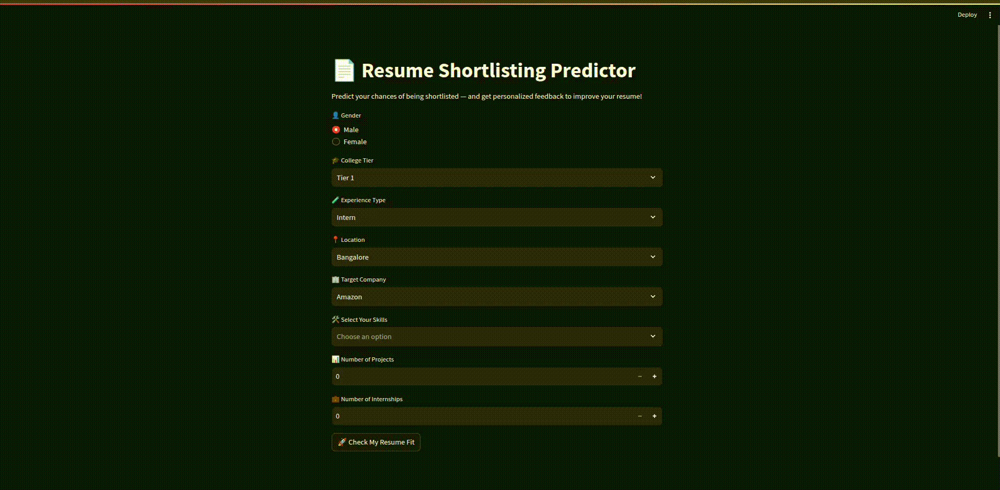

# 📄 Resume Shortlisting Predictor

**Predict your chances of getting shortlisted — and receive personalized feedback to enhance your resume.**

This project simulates how companies might use data to evaluate resumes. It allows users to input resume-related details like skills, education background, experience type, and target company, then predicts shortlisting probability using a trained machine learning model.  
Alongside the prediction, the app also provides actionable suggestions based on feature importance — helping users understand what could make their profile stronger.

> ⚡ Built as a hands-on learning project to explore real-world machine learning workflows with simple UI deployment.

---

## 🚀 Features

- ✅ Predicts resume shortlisting probability  
- ✅ Company-specific targeting and location awareness  
- ✅ Personalized resume improvement feedback using feature importance  
- ✅ Clean and intuitive web interface (Streamlit)  
- ✅ Modular backend using pickled ML models and encoded data  

---

## 🧠 ML Concepts Applied

- Categorical, one-hot, and multi-hot encoding  
- Feature engineering for resume data  
- Random Forest classification with evaluation metrics  
- Feature importance analysis for feedback generation  
- Serialization with Pickle  
- UI deployment using Streamlit  

---

## 💡 Why this project matters

- Demonstrates how ML can assist in resume screening  
- Bridges the gap between data science and deployment  
- Emphasizes explainability — not just prediction  
- Designed to explore a full ML pipeline in a practical context  

---

## Demo

---

## 📌 Future Enhancements

- [ ] Resume upload (PDF parsing and auto-fill)  
- [ ] Advanced model tuning (GridSearchCV, XGBoost, etc.)  
- [ ] Explainability with SHAP or LIME  
- [ ] Deployment to Streamlit Cloud or Hugging Face Spaces  

---

## 🧪 Note

This project is built for **learning purposes**, not to replicate or endorse automated hiring decisions. Real-world recruitment involves far more complexity, fairness considerations, and human judgment.
